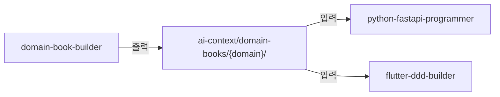

# CLAUDE.md

This file provides guidance to Claude Code (claude.ai/code) when working with code in this repository.

## 프로젝트 개요

**URECA Claude Plugins**는 도메인 주도 설계(DDD) 및 AI 기반 개발을 지원하는 Claude Code 플러그인 마켓플레이스입니다. Domain Book(기술 독립적 도메인 설계서) 생성부터 백엔드/프론트엔드 코드 자동 생성까지, 제품 기획에서 개발까지의 파이프라인을 제공합니다.

## 주요 명령어

```bash
# 마켓플레이스 전체 검증 (jq 필요)
./scripts/validate-all.sh

# Claude Code 플러그인 검증
claude plugin validate .

# 특정 플러그인만 검증
claude plugin validate plugins/domain-book-builder

# 전체 마켓플레이스 로드 테스트
claude --plugin-dir .

# 특정 플러그인만 로드 테스트
claude --plugin-dir ./plugins/domain-book-builder
```

## 커밋 메시지 규칙

Conventional Commits 사용:

```
<type>(<scope>): <subject>
```

- **type**: `feat`, `fix`, `docs`, `style`, `refactor`, `test`, `chore`
- **scope**: 플러그인 이름 (`domain-book-builder`, `python-fastapi-programmer`, `flutter-ddd-builder`) 또는 `marketplace`, `ci`, `docs`
- **subject**: 현재 시제, 첫 글자 소문자, 마침표 없음, 50자 이내

## 아키텍처

### 마켓플레이스 구조

```
claude/
├── .claude-plugin/
│   └── marketplace.json     # 마켓플레이스 카탈로그 (모든 플러그인 등록)
├── plugins/                 # 플러그인 컬렉션
│   ├── domain-book-builder/       # Phase 1: 도메인 설계서 생성
│   ├── python-fastapi-programmer/ # Phase 2: FastAPI 백엔드 코드 생성
│   └── flutter-ddd-builder/       # Phase 3: Flutter 앱 코드 생성
├── scripts/
│   └── validate-all.sh      # 전체 플러그인 구조 검증 스크립트
└── docs/                    # 설치, 개발, 트러블슈팅 문서
```

### 플러그인 내부 구조 규칙

**중요**: `commands/`, `agents/`, `skills/`, `hooks/` 디렉토리는 반드시 플러그인 루트에 위치해야 합니다. `.claude-plugin/` 디렉토리 안에 넣으면 작동하지 않습니다.

```
plugins/{plugin-name}/
├── .claude-plugin/
│   └── plugin.json          # 메타데이터만 (name, version, description)
├── agents/                  # 서브에이전트 프롬프트 (.md)
├── skills/                  # 자동 호출 스킬 (SKILL.md + templates/ + references/)
├── commands/                # 사용자 호출 명령어 (/plugin:command)
├── hooks/                   # PostToolUse 등 이벤트 훅 (hooks.json)
└── README.md
```

### 플러그인 간 관계 (파이프라인)



각 플러그인은 독립 실행 가능하지만, domain-book-builder의 출력이 다른 두 플러그인의 입력이 됩니다.

## 플러그인 상세

### Domain Book Builder (`plugins/domain-book-builder/`)

5단계 순차 워크플로우 (Phase 1-4: 사용자 승인 필요, Phase 5: 자동):
- Phase 1: 요구사항 명확화 (모호함 제거)
- Phase 2: 도메인별 상세 인터뷰
- Phase 3: 유비쿼터스 언어 명세 (서술형 도메인 모델)
- Phase 4: API 설계 (Request/Response + 수도코드)
- Phase 5: Domain Book 완성 (도메인 의존성 Topological Sort로 자동 해결)

상세: `plugins/domain-book-builder/CLAUDE.md` 참조

### Python FastAPI Programmer (`plugins/python-fastapi-programmer/`)

6단계 워크플로우 (Domain Book → FastAPI 코드):
- Git Worktree 기반 도메인별 병렬 코드 생성
- Vertical Slice + Clean Architecture 패턴
- PostToolUse 훅: Python 파일 Write/Edit 시 ruff 자동 린트 + 아키텍처 안티패턴 검사

상세: `plugins/python-fastapi-programmer/CLAUDE.md` 참조

### Flutter DDD Builder (`plugins/flutter-ddd-builder/`)

비즈니스 로직 + UI 레이어 분리 생성:
- logic-orchestrator: Freezed 모델 + Riverpod 서비스 병렬 생성
- ui-orchestrator: ASCII 와이어프레임 → ConsumerStatefulWidget 페이지 생성
- PostToolUse 훅: Dart 파일 Write/Edit 시 dart analyze + 안티패턴 검사

## Skills vs Commands vs Agents

- **Skills** (`skills/{name}/SKILL.md`): 에이전트가 컨텍스트에 따라 자동으로 참조하는 지식. frontmatter에 `name`, `description` 필수. 본문은 명령형, lean body 원칙(1,500-2,000 단어), 상세 내용은 `templates/` 또는 `references/`에 분리.
- **Commands** (`commands/{name}/SKILL.md` 또는 `commands/{name}.md`): 사용자가 `/plugin:command` 형식으로 직접 호출. frontmatter에 `argument-hint`, `allowed-tools` 지정 가능.
- **Agents** (`agents/{name}.md`): Task 도구로 호출되는 서브에이전트. frontmatter에 `identifier`, `tools`, `whenToUse` 지정.

## Hooks 패턴

현재 사용 중인 PostToolUse 훅:

- **python-fastapi-programmer**: Write/Edit 시 `ruff format` + `ruff check` 자동 실행, 아키텍처 안티패턴 프롬프트 검사 (cross-domain import, raw SQL, os.getenv 등)
- **flutter-ddd-builder**: Write/Edit 시 `dart analyze` 자동 실행, Dart 안티패턴 프롬프트 검사 (ref.watch 오용, Dto 네이밍, hardcoded spacing 등)

## 주의사항

### marketplace.json과 plugin.json 관계

- `marketplace.json` (`.claude-plugin/marketplace.json`): 마켓플레이스 카탈로그. 모든 플러그인을 `plugins` 배열에 등록.
- `plugin.json` (각 플러그인의 `.claude-plugin/plugin.json`): 개별 플러그인 메타데이터. marketplace.json 항목과 병합됨.

### 상대 경로 제약

marketplace.json의 `"source": "./plugins/plugin-name"` 형식은 Git 기반 마켓플레이스에서만 작동. URL 배포 시 GitHub/npm/git URL 사용 필요.

### 파일 복사 제약

플러그인 설치 시 플러그인 디렉토리만 복사됨. 외부 파일 참조(`../shared`) 불가. 공유 리소스는 플러그인 내부에 배치.
