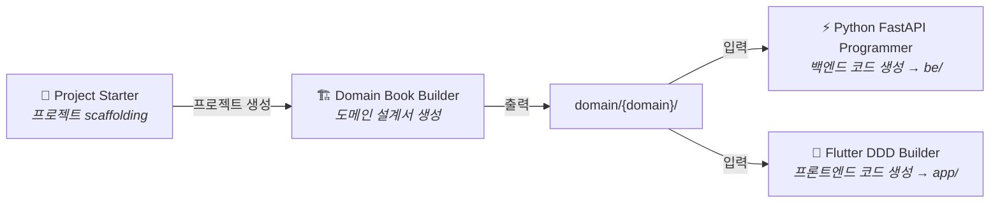

# URECA Claude Plugins

<div align="center">


**도메인 주도 설계 및 AI 기반 개발 도구 모음**

[설치하기](#-설치-방법) · [플러그인 목록](#-플러그인) · [기여하기](./CONTRIBUTING.md)

</div>

---

## 📖 소개

제품 기획부터 개발까지 전 과정을 지원하는 **Claude Code 플러그인 마켓플레이스**입니다.



---

## 🚀 설치 방법

```bash
# 1. 마켓플레이스 추가
/plugin marketplace add https://github.com/ureca-corp/claude

# 2. 원하는 플러그인 설치
/plugin install project-starter@ureca-plugins
/plugin install domain-book-builder@ureca-plugins
/plugin install python-fastapi-programmer@ureca-plugins
/plugin install flutter-ddd-builder@ureca-plugins

# 3. 설치 확인
/plugin list
```

---

## 🔌 플러그인

### Project Starter

Template repo 기반으로 새 프로젝트를 자동 생성합니다. `gh` CLI로 Flutter/FastAPI/Admin repo를 생성하고 하나의 디렉토리에 구성합니다.

```bash
/project-starter:new-project my-project
```

출력: `my-project/{app/, be/, admin/, domain/}`

[📚 상세 문서](./plugins/project-starter/README.md)

### Domain Book Builder

기술 독립적 도메인 설계 문서를 생성합니다. 5단계 점진적 워크플로우로 누구나 읽을 수 있는 "기획서"를 작성합니다.

```bash
/domain-book-builder:start
```

출력: `ai-context/domain-books/{domain}/` (README, features, domain-model, api-spec, business-rules)

[📚 상세 문서](./plugins/domain-book-builder/README.md)

### Python FastAPI Programmer

Domain Book을 읽어 FastAPI 백엔드를 자동 생성합니다. Git Worktree 병렬 코드 생성, Vertical Slice + Clean Architecture, JWT 인증, PostGIS 지원.

```bash
/python-fastapi-programmer:start
```

출력: `src/modules/{domain}/` (_models.py, {action}.py, router.py)

[📚 상세 문서](./plugins/python-fastapi-programmer/README.md)

### Flutter DDD Builder

Domain Book을 읽어 Flutter DDD 앱을 생성합니다. Freezed 3.x + Riverpod 3.x, 비즈니스 로직/UI 분리 생성, ASCII 와이어프레임 승인 후 UI 구현.

```bash
/flutter-ddd-builder:start
```

출력: `lib/{domain}/` (models, services, pages)

[📚 상세 문서](./plugins/flutter-ddd-builder/README.md)

---

## 🛠️ 개발 가이드

### 로컬 테스트 및 검증

```bash
# 전체 마켓플레이스 로드 테스트
claude --plugin-dir .

# 플러그인 구조 검증
claude plugin validate .

# 전체 검증 스크립트 (jq 필요)
./scripts/validate-all.sh
```

### 새 플러그인 추가

1. `plugins/your-plugin/.claude-plugin/plugin.json` 생성 (name, version, description)
2. `skills/`, `commands/`, `agents/`, `hooks/` 중 필요한 디렉토리를 **플러그인 루트**에 추가
3. `.claude-plugin/marketplace.json`의 `plugins` 배열에 등록
4. `claude plugin validate .`로 검증

> **주의**: 컴포넌트 디렉토리는 `.claude-plugin/` 안이 아닌 플러그인 루트에 위치해야 합니다.

---

## 📚 문서

| 문서 | 설명 |
|------|------|
| [설치 가이드](./docs/installation.md) | 상세 설치 및 설정 |
| [플러그인 개발](./docs/plugin-development.md) | 플러그인 생성 가이드 |
| [문제 해결](./docs/troubleshooting.md) | 일반적인 문제와 해결 |
| [기여 가이드](./CONTRIBUTING.md) | PR 제출 및 코드 스타일 |
| [변경 이력](./CHANGELOG.md) | 버전별 변경 사항 |
| [보안](./SECURITY.md) | 취약점 보고 절차 |

---

## 🤝 기여하기

```bash
git clone https://github.com/your-username/claude.git
cd claude
claude --plugin-dir .            # 로컬 테스트
./scripts/validate-all.sh        # 검증
git push origin feature/your-feature  # PR 제출
```

자세한 내용은 [CONTRIBUTING.md](./CONTRIBUTING.md)를 참조하세요.

---

## 📄 라이선스

[MIT License](./LICENSE) - Copyright (c) 2026 URECA Team

<div align="center">

**Made with ❤️ by URECA Team**

[GitHub](https://github.com/ureca-corp) · [Website](https://ureca.team)

</div>
