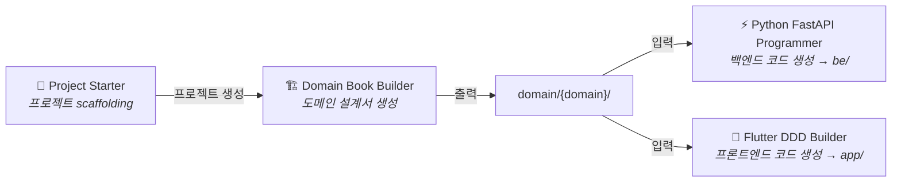

# URECA Claude Plugins

<div align="center">


**도메인 주도 설계 및 AI 기반 개발 도구 모음**

[설치하기](#-설치-방법) · [플러그인 목록](#-플러그인) · [독립 스킬](#-독립-스킬-skills) · [기여하기](./CONTRIBUTING.md)

</div>

---

## 📖 소개

제품 기획부터 개발까지 전 과정을 지원하는 **Claude Code 플러그인 마켓플레이스**입니다.


```mermaid
flowchart LR
    S["🚀 Project Starter<br/><i>프로젝트 scaffolding</i>"]
    A["🏗️ Domain Book Builder<br/><i>도메인 설계서 생성</i>"]
    B["domain/{domain}/"]
    C["⚡ Python FastAPI Programmer<br/><i>백엔드 코드 생성 → be/</i>"]
    D["📱 Flutter DDD Builder<br/><i>프론트엔드 코드 생성 → app/</i>"]

    S -->|프로젝트 생성| A
    A -->|출력| B
    B -->|입력| C
    B -->|입력| D
```

위 4개는 "기획 → 백엔드/프론트엔드 코드 생성"으로 이어지는 핵심 파이프라인이고, 이 외에도 Git 워크플로우 자동화·문서화 체계 구축·Figma 코드 변환 같은 독립 유틸리티 플러그인이 함께 들어있다. 전체 목록은 [🔌 플러그인](#-플러그인) 참고.

---

## 🚀 설치 방법

설치 방법은 두 가지다. **무엇을 설치하고 싶은지**에 따라 고른다.

| | 플러그인 설치 | 개별 스킬 설치 |
|---|---|---|
| 무엇이 설치되나 | 커맨드(`/x:y`) + 에이전트 + 훅 + 스킬 전체 번들 | SKILL.md 하나(+레퍼런스 파일) |
| 설치 도구 | Claude Code 내장 `/plugin` | [`npx skills`](https://github.com/vercel-labs/skills) (Claude Code 외 다른 에이전트 하네스도 지원) |
| 이럴 때 | 워크플로우를 커맨드로 실행하고 싶을 때 (예: `/domain-book-builder:start`) | 특정 패턴·가드레일만 Claude가 알아서 참고하게 하고 싶을 때 |

### 방법 1: 플러그인 설치 (전체 기능)

```bash
# 1. 마켓플레이스 추가
/plugin marketplace add https://github.com/ureca-corp/claude

# 2. 원하는 플러그인 설치
/plugin install project-starter@ureca-plugins
/plugin install domain-book-builder@ureca-plugins
/plugin install python-fastapi-programmer@ureca-plugins
/plugin install flutter-ddd-builder@ureca-plugins
/plugin install project-docs-setup@ureca-plugins
/plugin install figma2shadcn2next@ureca-plugins
/plugin install git-split-pr@ureca-plugins

# 3. 설치 확인
/plugin list
```

### 방법 2: 개별 스킬 설치 (`npx skills`)

```bash
# 이 레포에 어떤 스킬이 있는지 먼저 확인
npx skills add ureca-corp/claude --list

# 원하는 스킬만 설치 (user scope 전역 설치는 -g 추가)
npx skills add ureca-corp/claude --skill "<스킬 이름>"
```

전체 목록과 정확한 설치 명령은 [🧩 독립 스킬](#-독립-스킬-skills) 참고.

---

## 🔌 플러그인

| 플러그인 | 한 줄 소개 | 설치 |
|---|---|---|
| [Project Starter](#project-starter) | Flutter/FastAPI/Admin 모노레포를 gh CLI로 한 번에 생성 | `/plugin install project-starter@ureca-plugins` |
| [Domain Book Builder](#domain-book-builder) | 기술 독립적 도메인 설계서를 대화형 5단계로 완성 | `/plugin install domain-book-builder@ureca-plugins` |
| [Python FastAPI Programmer](#python-fastapi-programmer) | Domain Book 기반 FastAPI 백엔드 자동 생성 | `/plugin install python-fastapi-programmer@ureca-plugins` |
| [Flutter DDD Builder](#flutter-ddd-builder) | Domain Book 기반 Flutter DDD 앱 자동 생성 | `/plugin install flutter-ddd-builder@ureca-plugins` |
| [Project Docs Setup](#project-docs-setup) | README/AGENTS.md/CLAUDE.md/ai-context 4-파일 문서화 체계 구축 | `/plugin install project-docs-setup@ureca-plugins` |
| [figma2shadcn2next](#figma2shadcn2next) | Figma 컴포넌트를 토큰 정확도 높게 Next.js 16 + shadcn/ui 코드로 변환 | `/plugin install figma2shadcn2next@ureca-plugins` |
| [git-split-pr](#git-split-pr) | 세션 변경사항을 업무 단위 PR로 자동 분리·생성·모니터링 | `/plugin install git-split-pr@ureca-plugins` |

### Project Starter

**목적**: 새 프로젝트를 시작할 때마다 반복되는 저장소 생성·템플릿 복사·브랜치 세팅을 자동화한다. Flutter 앱(`app/`)·FastAPI 백엔드(`be/`)·Next.js 관리자(`admin/`)를 하나의 GitHub 모노레포(`ureca-corp` org 고정)로 구성하고, 배포용 브랜치(`deploy/app`, `deploy/dev/be`, `deploy/prod/be` 등)까지 미리 만들어 push한다.

**설치 및 사용**:
```bash
/plugin install project-starter@ureca-plugins
/project-starter:new-project my-project
```

출력: `my-project/{app/, be/, admin/, domain/}`

**언제 쓰나**: Flutter + FastAPI(+ Next.js 관리자) 조합의 새 서비스를 사내 표준 구조로 수작업 없이 처음부터 갖추고 싶을 때. 생성 후 Domain Book Builder → Python FastAPI Programmer / Flutter DDD Builder로 이어가는 것이 표준 흐름이다.

[📚 상세 문서](./plugins/project-starter/README.md)

### Domain Book Builder

**목적**: 코드를 한 줄도 생성하지 않고, 제품 아이디어를 배치 질문(최대 4개씩)으로 명확화하며 기술 스택과 완전히 독립적인 도메인 설계서를 집필한다. 요구사항 명확화 → 도메인별 인터뷰 → 유비쿼터스 언어 정의 → API 명세 → 최종 문서화 순 5단계를 거치며, 답변마다 세션 상태를 즉시 갱신해 중간에 끊겨도 이어서 진행할 수 있다.

**설치 및 사용**:
```bash
/plugin install domain-book-builder@ureca-plugins
/domain-book-builder:start
```

출력: `ai-context/domain-books/{domain}/` 아래 도메인당 5개 파일(README, features, domain-model, api-spec, business-rules). HTTP·JWT·UUID 같은 기술 용어를 쓰지 않아 어떤 구현체(백엔드/앱/웹)에도 그대로 적용 가능하다.

**언제 쓰나**: 새 제품·기능을 만들기 전, 개발자·기획자·디자이너 모두가 읽을 수 있는 도메인 설계서를 대화형으로 처음부터 뽑아내고 싶을 때.

[📚 상세 문서](./plugins/domain-book-builder/README.md)

### Python FastAPI Programmer

**목적**: Domain Book(README/features/domain-model/api-spec/business-rules)을 입력받아 FastAPI 프로젝트를 자동 생성한다. 검증 → 리서치 → 환경변수 → 도메인별 병렬 코드 생성 → 코드 리뷰 → API 문서화 6단계 파이프라인이며, Vertical Slice + Clean Architecture, SQLModel ORM, JWT 인증, PostGIS 위치정보 이중 저장 규칙을 전 과정에 강제한다. 도메인마다 Git Worktree로 작업공간을 격리해 병렬 구현한다.

**설치 및 사용**:
```bash
/plugin install python-fastapi-programmer@ureca-plugins
/start                    # 전체 파이프라인
/guard {domain}           # 기존 레이어 기반 코드를 Vertical Slice로 리팩토링만
```

출력: `src/modules/{domain}/` (`_models.py`, `{action}.py`, `router.py`)

**언제 쓰나**: 이미 작성된 Domain Book으로 새 FastAPI 백엔드를 표준 아키텍처로 처음부터 생성하고 싶을 때는 `/start`, 기존 프로젝트 구조만 정리하고 싶을 때는 `/guard {domain}`.

[📚 상세 문서](./plugins/python-fastapi-programmer/README.md)

### Flutter DDD Builder

**목적**: Domain Book을 읽어 Flutter DDD 아키텍처의 비즈니스 로직(Freezed 모델·Riverpod AsyncNotifier·GoRouter·API 클라이언트)과 UI 코드를 생성한다. git worktree로 작업 공간을 분리한 뒤 에이전트 팀이 도메인/화면 단위로 병렬 구현하고, 파일을 쓸 때마다 `flutter analyze`를 자동 실행해 품질을 실시간으로 담보한다.

**설치 및 사용**:
```bash
/plugin install flutter-ddd-builder@ureca-plugins
/start              # 전체 파이프라인(로직+UI)
/start --skip-ui    # 로직 레이어만
/logic              # 로직 레이어만
/ui                 # UI 레이어만
```

출력: `lib/{domain}/` (models, services, pages)

**언제 쓰나**: Domain Book이 이미 있는 Flutter 프로젝트에서 Freezed/Riverpod 로직 코드와 화면 UI를 실제로 뽑아내고 싶을 때.

[📚 상세 문서](./plugins/flutter-ddd-builder/README.md)

### Project Docs Setup

**목적**: 사람용 `README.md`(개요·기능·아키텍처 트리·Mermaid 흐름), AI 에이전트용 `AGENTS.md`(핵심 규칙·제약), Claude Code 전용 진입점 `CLAUDE.md`(`@AGENTS.md` 한 줄 임포트), 에이전트용 상세 문서 색인 `ai-context/`(`TOC.md`)까지 4-파일 문서화 체계를 한 번에 생성·갱신한다. 프로젝트 탐색 → 4개 파일 작성 → 파일 간 이름/링크 일관성 검증 순으로 진행된다.

**설치 및 사용**:
```bash
/plugin install project-docs-setup@ureca-plugins
```
```
문서화 체계 잡아줘 / AGENTS.md 만들어줘 / ai-context 폴더 구조 세팅해줘
```

**언제 쓰나**: 새 프로젝트를 막 시작했거나, 기존 저장소의 `AGENTS.md`·`ai-context/`가 없거나 프로젝트 구조와 어긋나 있을 때.

[📚 상세 문서](./plugins/project-docs-setup/README.md)

### figma2shadcn2next

**목적**: 디자이너가 Figma에 만든 Ureca Shadcn 팀 라이브러리 컴포넌트를, 개발자가 눈대중으로 옮겨 적으며 생기는 색상·간격·라운드값 오차와 Light/Dark 모드 누락 없이 Next.js 16 + shadcn/ui 코드로 변환한다. Figma 변수(boundVariables)를 usage→semantic→primitive 순서로 끝까지 추적하는 토큰 체인 규칙을 강제해 에이전트마다 결과가 달라지는 편차를 줄인다. 토큰 검증·시각적 일치 검증 서브에이전트가 자동으로 뒤따라 실행된다.

**설치 및 사용**:
```bash
/plugin install figma2shadcn2next@ureca-plugins
/figma2shadcn2next:implement-figma-shadcn-next16 https://www.figma.com/design/AbCdEfGh/Ureca-Shadcn?node-id=123:456
```

출력: 인라인 토큰 주석이 달린 TSX 컴포넌트 + `IMPLEMENTATION_REPORT.md`(토큰 매핑표·미해결 항목·fidelity 검증 결과)

**언제 쓰나**: Figma의 Ureca Shadcn 팀 라이브러리 컴포넌트·화면을 Next.js 16 + shadcn/ui 프로젝트에 토큰·다크모드까지 정확히 맞춰 코드로 옮겨야 할 때.

[📚 상세 문서](./plugins/figma2shadcn2next/README.md)

### git-split-pr

**목적**: 한 세션에서 여러 작업이 뒤섞여 커밋되지 않은 변경사항을 `git diff`로 파악해 기능·유형별 업무 단위로 분류하고(사용자 확인 필수), 단위마다 브랜치 생성 → 한글 커밋 → 푸시 → PR 생성까지 처리한다. PR 생성 후에는 `/loop` 스킬로 리뷰/CI 상태를 주기적으로 추적해 승인·통과 여부를 보고한다.

**설치 및 사용**:
```bash
/plugin install git-split-pr@ureca-plugins
```
```
diff 확인하고 PR 나눠줘 / 변경사항 브랜치로 분리해줘 / PR 리뷰 모니터링해줘
```

**언제 쓰나**: 한 세션에서 뒤섞인 변경사항을 리뷰하기 좋은 단위의 여러 PR로 깔끔하게 나눠 올리고, 승인·CI 통과까지 자동으로 지켜보고 싶을 때.

[📚 상세 문서](./plugins/git-split-pr/README.md)

---

## 🧩 독립 스킬 (Skills)

플러그인 전체(커맨드·에이전트·훅 포함)를 설치하지 않고 **스킬 하나만** 콕 집어 설치하고 싶을 때 [`npx skills`](https://github.com/vercel-labs/skills)를 쓴다. Claude Code뿐 아니라 `npx skills`가 지원하는 다른 에이전트 하네스(`-a` 옵션)에도 그대로 설치된다.

```bash
# 이 레포에 어떤 스킬이 있는지 먼저 확인
npx skills add ureca-corp/claude --list

# 특정 스킬만 설치 (user scope 전역 설치는 -g 추가)
npx skills add ureca-corp/claude --skill "<스킬 이름>"
```

> 스킬 이름에 공백·콜론·화살표 같은 특수문자가 있으면 반드시 따옴표로 감싼다. 아래 표의 "설치 명령"을 그대로 복사해서 쓰면 된다.

> **왜 13개뿐인가요?** `domain-book-builder`의 5개 스킬(clarify, interview-domain, model-domain, design-api, write-book)은 여기 없다. `/domain-book-builder:start` 커맨드가 세션 상태 파일을 넘겨가며 순서대로 실행하는 5단계 파이프라인의 내부 스텝이라, 하나만 떼어 설치해도 앞뒤 단계 없이는 완결된 결과물을 만들 수 없기 때문이다. 이 워크플로우가 필요하면 [Domain Book Builder 플러그인 자체를 설치](#domain-book-builder)한다. `project-starter`도 커맨드(`/project-starter:new-project`) 하나로만 구성돼 있어 독립 스킬이 없다.

### 한눈에 보기

| 스킬 | 소속 | 무엇을 하나 | 설치 명령 |
|---|---|---|---|
| plan-build-verify | (독립) | 계획→슬라이스 구현→난이도별 적응 리뷰→이슈 0건까지 리팩토링→빌드/테스트 게이트 | `npx skills add ureca-corp/claude --skill plan-build-verify` |
| Implement Figma → Next.js 16 + shadcn/ui | figma2shadcn2next | Figma 컴포넌트를 토큰 체인까지 정확히 맞춰 Next.js 16 + shadcn/ui 코드로 변환 | `npx skills add ureca-corp/claude --skill "Implement Figma → Next.js 16 + shadcn/ui"` |
| Flutter DDD Patterns | flutter-ddd-builder | Freezed·Riverpod 기반 Flutter DDD 코드 작성 체크리스트·레퍼런스·예시 | `npx skills add ureca-corp/claude --skill "Flutter DDD Patterns"` |
| Git Worktree Management | flutter-ddd-builder | 여러 브랜치를 worktree로 나눠 병렬 작업 후 병합·정리하는 절차 | `npx skills add ureca-corp/claude --skill "Git Worktree Management"` |
| Team Collaboration Patterns | flutter-ddd-builder | Teammate/TaskList/SendMessage로 멀티 에이전트가 협업하는 방법 | `npx skills add ureca-corp/claude --skill "Team Collaboration Patterns"` |
| git-split-pr | git-split-pr | 세션 변경사항을 업무 단위로 나눠 브랜치·한글 커밋·PR·리뷰 모니터링까지 자동화 | `npx skills add ureca-corp/claude --skill git-split-pr` |
| project-docs-setup | project-docs-setup | README/AGENTS.md/CLAUDE.md/ai-context 4-파일 문서화 체계 구축·갱신 | `npx skills add ureca-corp/claude --skill project-docs-setup` |
| ddd-class-diagram | python-fastapi-programmer | domain-model.md를 Mermaid ER 다이어그램으로 변환 | `npx skills add ureca-corp/claude --skill "python-fastapi-programmer:ddd-class-diagram"` |
| fastapi-architecture | python-fastapi-programmer | Vertical Slice + Clean Architecture 폴더 구조·네이밍 규칙 | `npx skills add ureca-corp/claude --skill "python-fastapi-programmer:fastapi-architecture"` |
| fastapi-postgis | python-fastapi-programmer | 위경도 + PostGIS POINT 이중 저장 패턴 | `npx skills add ureca-corp/claude --skill "python-fastapi-programmer:fastapi-postgis"` |
| fastapi-security | python-fastapi-programmer | JWT·ORM·해싱 등 FastAPI 보안 필수 규칙 체크리스트 | `npx skills add ureca-corp/claude --skill "python-fastapi-programmer:fastapi-security"` |
| git-worktree-parallel | python-fastapi-programmer | 도메인별 worktree 격리로 병렬 백엔드 개발 | `npx skills add ureca-corp/claude --skill "python-fastapi-programmer:git-worktree-parallel"` |
| guard | python-fastapi-programmer | Vertical Slice 규칙 강제 + 레이어 기반 코드 자동 리팩토링(`/guard {domain}`) | `npx skills add ureca-corp/claude --skill "python-fastapi-programmer:guard"` |

### 상세

<details>
<summary><strong>plan-build-verify</strong> · 독립 스킬</summary>

비자명한 코딩 작업을 **계획+난이도(tier) 판정 → 슬라이스별 구현 → tier에 맞춘 적응 리뷰(경량~풀) → 이슈 0건까지 리팩토링 → 최종 빌드/테스트 통과 보장** 파이프라인으로 끝까지 수행하는 다중 에이전트 워크플로우 스킬. 슬라이스 난이도에 따라 Claude 리뷰 관점 수(1~4개)와 Codex 적대적 리뷰 여부를 자동 조절한다.

[📚 상세 문서](./skills/plan-build-verify/SKILL.md) · [설치 안내](./skills/plan-build-verify/INSTALL.md)
</details>

<details>
<summary><strong>Implement Figma → Next.js 16 + shadcn/ui</strong> · figma2shadcn2next</summary>

Figma URL·노드를 입력받아 MCP로 메타데이터·변수 정의·디자인 컨텍스트를 읽고, 모든 시각 속성(fill·stroke·spacing·radius·typography)을 boundVariables부터 usage→semantic→primitive 순서로 해석해 Light/Dark 모드를 semantic 계층에서만 분기시킨 TSX 컴포넌트를 생성한다. 토큰 검증·시각 fidelity 검증 서브에이전트가 뒤따라 실행돼 `IMPLEMENTATION_REPORT.md`로 결과를 종합한다. Figma MCP 연결과 Next.js 16 + shadcn/ui 프로젝트 구조가 전제조건이다.

[📚 상세 문서](./plugins/figma2shadcn2next/skills/implement-figma-shadcn-next16/SKILL.md)
</details>

<details>
<summary><strong>Flutter DDD Patterns</strong> · flutter-ddd-builder</summary>

Freezed 3.x 모델, Riverpod 3.x AsyncNotifier 서비스, go_router 라우트, 인증 상태 관리, 페이지네이션, 폼 검증, 다크/라이트 테마 등 프로젝트 표준 아키텍처의 체크리스트·네이밍 규칙·코드 생성 명령을 제공한다. Freezed/Riverpod 상세 가이드, API 클라이언트 패턴, 10가지 안티패턴 레퍼런스와 5개의 동작하는 예시 dart 파일이 함께 딸려 있다.

[📚 상세 문서](./plugins/flutter-ddd-builder/skills/flutter-ddd-patterns/SKILL.md)
</details>

<details>
<summary><strong>Git Worktree Management</strong> · flutter-ddd-builder</summary>

도메인/화면 단위로 별도의 git worktree와 feature 브랜치를 만들어 여러 에이전트가 충돌 없이 동시에 작업하게 하고, 완료 후 `--no-ff`/squash/fast-forward 전략으로 병합한 뒤 worktree·브랜치를 정리하는 표준 절차를 제공한다. worktree 중복 생성, 병합 충돌, 잠긴 worktree 같은 흔한 오류의 해결 명령도 포함한다.

[📚 상세 문서](./plugins/flutter-ddd-builder/skills/git-worktree-management/SKILL.md)
</details>

<details>
<summary><strong>Team Collaboration Patterns</strong> · flutter-ddd-builder</summary>

팀 생성(spawnTeam)부터 작업 항목 생성·의존성 설정(TaskCreate/blockedBy), 작업 선점·완료 처리(TaskUpdate), 팀원 간 메시지(SendMessage), 팀원 종료·정리까지 멀티 에이전트 협업의 전체 생명주기를 다룬다. 의존성 대기·작업 재할당·컴포넌트 중복 같은 상황에 대한 대응 패턴도 예시로 제공한다.

[📚 상세 문서](./plugins/flutter-ddd-builder/skills/team-collaboration-patterns/SKILL.md)
</details>

<details>
<summary><strong>git-split-pr</strong> · git-split-pr</summary>

`git status`/`diff`로 세션의 모든 변경사항을 파악해 업무 단위로 그룹화하고 사용자 확인을 받은 뒤, 단위마다 브랜치 생성 → 한글 커밋(비개발자도 이해할 리스트 형태) → 푸시 → `gh pr create`까지 처리한다. 리뷰어가 지정된 PR은 `/loop` 스킬로 모니터링하며 CHANGES_REQUESTED나 CI 실패를 감지해 보고한다.

[📚 상세 문서](./plugins/git-split-pr/skills/git-split-pr/SKILL.md)
</details>

<details>
<summary><strong>project-docs-setup</strong> · project-docs-setup</summary>

빌드 설정·기존 문서·루트 구조를 훑어 프로젝트명·기술스택·모듈 구성을 파악한 뒤, README.md(기능·아키텍처 트리·Mermaid), AGENTS.md(핵심 규칙, 60줄 넘으면 ai-context로 위임), CLAUDE.md(`@AGENTS.md` 한 줄), `ai-context/TOC.md`와 번호매김 문서를 작성·갱신한다. 마지막에 4개 파일 간 이름·링크 일관성을 검증한다.

[📚 상세 문서](./plugins/project-docs-setup/skills/project-docs-setup/SKILL.md)
</details>

<details>
<summary><strong>ddd-class-diagram</strong> · python-fastapi-programmer</summary>

`domain-model.md`에 정의된 엔티티·관계·Enum·Cascade 규칙을 읽어 PK/FK, NOT NULL, 인덱스 전략까지 포함한 Mermaid erDiagram 문서(`docs/DDD_CLASS_DIAGRAM.md`)를 생성한다. 실제 SQLModel 엔티티로 옮기기 전 데이터 모델을 시각적으로 정리·검증하는 용도다.

[📚 상세 문서](./plugins/python-fastapi-programmer/skills/ddd-class-diagram/SKILL.md)
</details>

<details>
<summary><strong>fastapi-architecture</strong> · python-fastapi-programmer</summary>

기능별로 DTO·Service·Controller를 한 파일에 묶는 Vertical Slice 방식과 Entities→Use Cases→Interface Adapters로 이어지는 Clean Architecture 계층을 결합한 표준 디렉토리 구조(`core`/`modules`/`app`)를 제시한다. Request/Response 접미사 DTO 네이밍 규칙과 프론트엔드 에이전트용 OpenAPI 메타데이터 작성법도 규정한다.

[📚 상세 문서](./plugins/python-fastapi-programmer/skills/fastapi-architecture/SKILL.md)
</details>

<details>
<summary><strong>fastapi-postgis</strong> · python-fastapi-programmer</summary>

SQLModel 엔티티에 latitude/longitude 컬럼과 PostGIS POINT geometry 컬럼을 동시에 저장해, 클라이언트 응답에는 좌표값을 그대로 노출하면서 `ST_DWithin` 같은 공간 인덱싱·거리 계산 쿼리도 지원하는 이중 저장 전략을 예제 코드로 제공한다.

[📚 상세 문서](./plugins/python-fastapi-programmer/skills/fastapi-postgis/SKILL.md)
</details>

<details>
<summary><strong>fastapi-security</strong> · python-fastapi-programmer</summary>

JWT Bearer Token 인증, SQL 인젝션 방지를 위한 SQLModel ORM 전용 사용(raw SQL 금지), 시크릿 하드코딩 금지(환경변수 필수), bcrypt 비밀번호 해싱, 로그 민감정보 마스킹, 표준화된 에러 응답까지 6가지 보안 규칙을 Do/Don't 코드 예시와 함께 제시한다.

[📚 상세 문서](./plugins/python-fastapi-programmer/skills/fastapi-security/SKILL.md)
</details>

<details>
<summary><strong>git-worktree-parallel</strong> · python-fastapi-programmer</summary>

도메인마다 별도의 worktree(`.worktrees/{domain}/`)를 만들어 각 팀(에이전트)이 충돌 없이 독립적으로 작업하고, 완료 후 메인 브랜치에 병합한 뒤 worktree를 정리하는 흐름을 제시한다. Topological Sort 기반 팀별 실행과 병렬 커밋으로 도메인 간 코드 충돌을 방지하는 것이 핵심이다.

[📚 상세 문서](./plugins/python-fastapi-programmer/skills/git-worktree-parallel/SKILL.md)
</details>

<details>
<summary><strong>guard</strong> · python-fastapi-programmer</summary>

1파일=1기능(DTO+Service+Controller 통합), 공유 로직은 언더스코어 prefix(`_models.py` 등) 같은 아키텍처 규칙을 정의한다. 이미 `controller.py`/`service.py`/`entities.py`처럼 레이어별로 나뉜 기존 코드가 있으면 `/guard {domain}` 명령으로 분석→계획→생성→테스트분리→검증→정리 6단계를 거쳐 Vertical Slice 구조로 자동 변환한다.

[📚 상세 문서](./plugins/python-fastapi-programmer/skills/guard/SKILL.md)
</details>

---

## 🛠️ 개발 가이드

### 로컬 테스트 및 검증

```bash
# 전체 마켓플레이스 로드 테스트
claude --plugin-dir .

# 플러그인 구조 검증
claude plugin validate .

# 전체 검증 스크립트 (jq 필요)
./scripts/validate-all.sh
```

### 새 플러그인 추가

1. `plugins/your-plugin/.claude-plugin/plugin.json` 생성 (name, version, description)
2. `skills/`, `commands/`, `agents/`, `hooks/` 중 필요한 디렉토리를 **플러그인 루트**에 추가
3. `.claude-plugin/marketplace.json`의 `plugins` 배열에 등록
4. `claude plugin validate .`로 검증

> **주의**: 컴포넌트 디렉토리는 `.claude-plugin/` 안이 아닌 플러그인 루트에 위치해야 합니다.

### 독립 스킬 카탈로그 동기화

최상위 `skills/<plugin>/<skill>/`는 `plugins/<plugin>/skills/<skill>/`의 **복사본**이다. `npx skills`는 심볼릭 링크를 따라가지 않고 실제 파일만 스캔하므로 심볼릭 링크가 아닌 복사로 구성돼 있다.

플러그인 안의 스킬을 추가·수정·삭제했다면 아래 스크립트를 다시 실행해 카탈로그를 원본과 맞춘다:

```bash
./scripts/sync-skills-catalog.sh
```

새 스킬을 독립 설치 대상에 추가하려면 `scripts/sync-skills-catalog.sh`의 `STANDALONE_SKILLS` 목록에 `"plugin/skill"` 형식으로 한 줄 추가하고, README의 [🧩 독립 스킬](#-독립-스킬-skills) 표에도 반영한다. SESSION.md 같은 공유 상태에 의존하는 파이프라인 내부 스텝(예: domain-book-builder의 5단계)은 목록에 넣지 않는다 — 단독 설치해도 동작하지 않기 때문이다.

> **SKILL.md 작성 시 주의**: frontmatter의 `description`은 YAML로 엄격하게 파싱된다. 따옴표 없이 문장 중간에 `키워드: "값"` 처럼 콜론+공백이 들어가면 파싱이 깨져 `npx skills` 목록에서 조용히 빠진다. 긴 설명은 project-docs-setup처럼 `description: |`(줄바꿈 보존) 또는 git-split-pr처럼 `description: >-`(한 줄로 접힘) 블록 스칼라를 쓴다.

---

## 📚 문서

| 문서 | 설명 |
|------|------|
| [설치 가이드](./docs/installation.md) | 상세 설치 및 설정 |
| [플러그인 개발](./docs/plugin-development.md) | 플러그인 생성 가이드 |
| [문제 해결](./docs/troubleshooting.md) | 일반적인 문제와 해결 |
| [기여 가이드](./CONTRIBUTING.md) | PR 제출 및 코드 스타일 |
| [변경 이력](./CHANGELOG.md) | 버전별 변경 사항 |
| [보안](./SECURITY.md) | 취약점 보고 절차 |

---

## 🤝 기여하기

```bash
git clone https://github.com/your-username/claude.git
cd claude
claude --plugin-dir .            # 로컬 테스트
./scripts/validate-all.sh        # 검증
git push origin feature/your-feature  # PR 제출
```

자세한 내용은 [CONTRIBUTING.md](./CONTRIBUTING.md)를 참조하세요.

---

## 📄 라이선스

[MIT License](./LICENSE) - Copyright (c) 2026 URECA Team

<div align="center">

**Made with ❤️ by URECA Team**

[GitHub](https://github.com/ureca-corp) · [Website](https://ureca.team)

</div>
