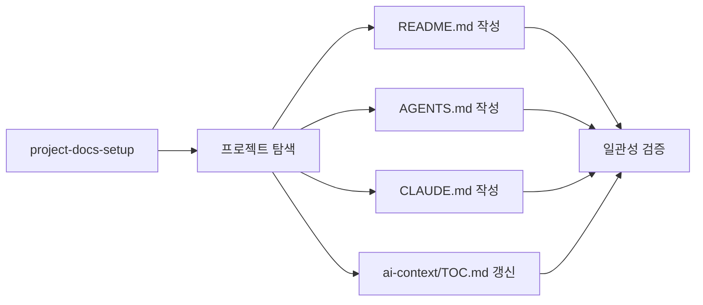

# Project Docs Setup

어떤 프로젝트에서든 사람과 AI 에이전트가 각자 필요한 정보를 빠르게 찾을 수 있는 4-파일 문서화 체계를 세우는 플러그인입니다.

## 사용법

```bash
/project-docs-setup
```

또는 자연어로 트리거:
- "문서화 체계 잡아줘"
- "AGENTS.md 만들어줘"
- "ai-context 폴더 구조 세팅해줘"

## 생성되는 구조

```
{project-root}/
├── README.md          ← 사람용: 개요·기능·아키텍처 트리·Mermaid 흐름
├── AGENTS.md          ← AI 에이전트용: 규칙·제약·먼저 읽을 문서
├── CLAUDE.md          ← Claude 진입점: @AGENTS.md 한 줄
└── ai-context/
    ├── TOC.md         ← 에이전트 상세 문서 색인
    ├── 01_north-star.md
    └── 02_architecture-principles.md
```

## 워크플로우


