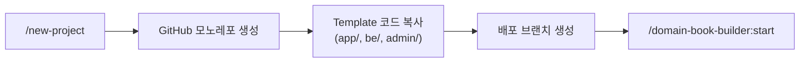

# Project Starter

모노레포 기반 새 프로젝트를 자동 생성하는 플러그인입니다. 하나의 GitHub repo에 모든 스택을 구성하고, 배포는 브랜치로 분리합니다.

## 사용법

```bash
/project-starter:new-project my-project
```

## 워크플로우



## Template Repos

| Stack | Template Repo | 디렉토리 |
|-------|--------------|-----------|
| Flutter App | `ureca-corp/claude-code-flutter-template` | `app/` |
| FastAPI Backend | `ureca-corp/claude-code-python-fastapi-template` | `be/` |
| Next.js Admin | (미정) | `admin/` |

## 생성되는 구조

```
{project-name}/          ← 하나의 GitHub repo
├── domain/              ← Domain Books
├── app/                 ← Flutter App
├── be/                  ← FastAPI Backend
├── admin/               ← Next.js Admin
├── CLAUDE.md
└── README.md
```

## 브랜치 전략

| 브랜치 | 용도 |
|--------|------|
| `main` | 개발용 (전체 모노레포) |
| `feature/*` | 기능 개발 |
| `deploy/app` | Flutter 앱 배포 |
| `deploy/dev/be` | 백엔드 개발 배포 |
| `deploy/prod/be` | 백엔드 프로덕션 배포 |

## 전제 조건

- `gh` CLI 설치 및 인증 (`gh auth login`)
- Template repo 접근 권한
