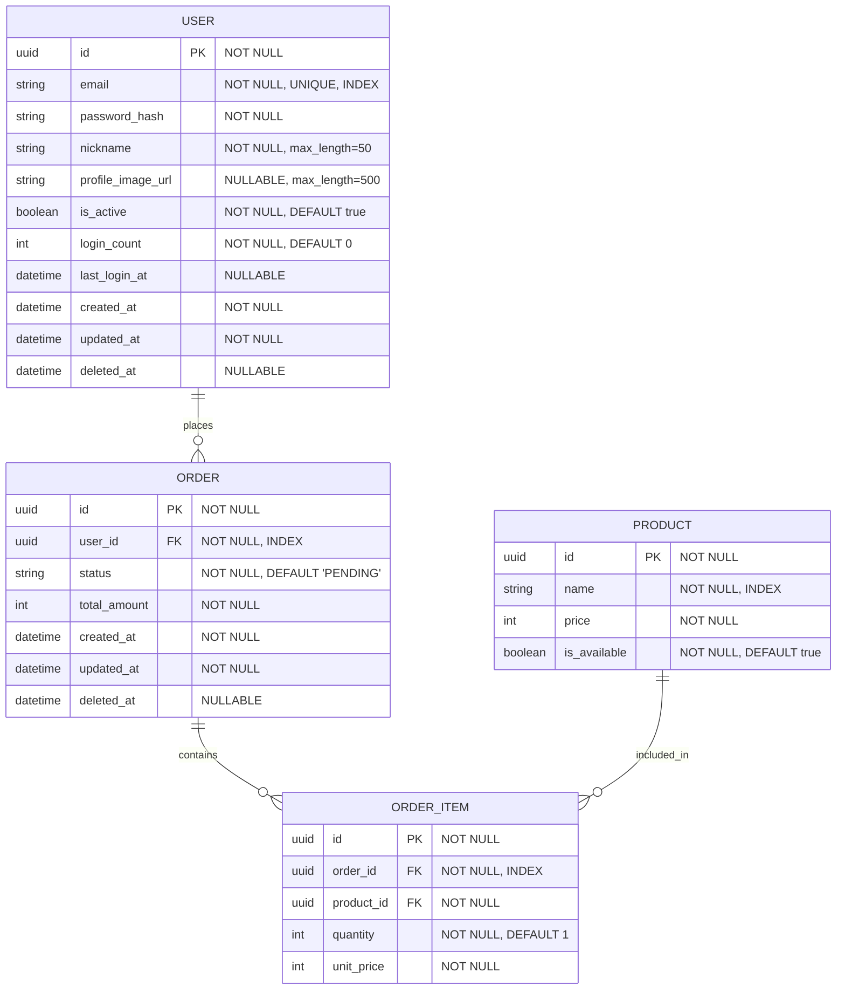

# DDD Class Diagram Template

## Mermaid erDiagram 문법 참조

### 기본 Entity 정의

```mermaid
erDiagram
    ENTITY_NAME {
        type field_name constraint "annotations"
    }
```

### 타입 매핑 (Python → Mermaid)

| Python Type | Mermaid Type | SQLModel Field |
|-------------|-------------|----------------|
| `UUID` | `uuid` | `Field(primary_key=True)` |
| `str` | `string` | `Field(max_length=N)` |
| `int` | `int` | `Field(default=0)` |
| `float` | `float` | `Field()` |
| `bool` | `boolean` | `Field(default=True)` |
| `datetime` | `datetime` | `Field(default_factory=utcnow)` |
| `Enum` | `string` | `Field()` — DB에는 string 저장 |

### 제약 조건 표기

| 표기 | 의미 |
|------|------|
| `PK` | Primary Key |
| `FK` | Foreign Key |
| `"NOT NULL"` | 필수 필드 |
| `"NULLABLE"` | 선택 필드 |
| `"UNIQUE"` | 유니크 제약 |
| `"INDEX"` | 단일 인덱스 |
| `"DEFAULT value"` | 기본값 |

### 관계 표기

| 기호 | 의미 |
|------|------|
| `\|\|--o{` | 1:N (one-to-many) |
| `\|\|--\|\|` | 1:1 (one-to-one) |
| `}o--o{` | N:M (many-to-many) |

### 완전한 예시



### Fetch 전략 주석

Mermaid에서는 직접 지원하지 않으므로 별도 테이블로 문서화:

| Parent | Child | Strategy | Reason |
|--------|-------|----------|--------|
| ORDER | ORDER_ITEM | EAGER | 주문 조회 시 항상 아이템 필요 |
| USER | ORDER | LAZY | 사용자 조회 시 주문 불필요 |

### Orphan Removal

| Parent | Child | Orphan Removal | 설명 |
|--------|-------|----------------|------|
| ORDER | ORDER_ITEM | YES | 주문 삭제 시 아이템도 삭제 |
